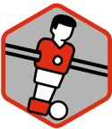

# foosball3 

<!-- badges: start -->

<!-- badges: end -->

The goal of foosball3 is to …

## Installation

You can install the development version of foosball3 like so:

``` r
# FILL THIS IN! HOW CAN PEOPLE INSTALL YOUR DEV PACKAGE?
```

## Example

This is a basic example which shows you how to solve a common problem:

``` r
library(foosball3)
## basic example code
```

TODO

## Code of Conduct

Please note that the foosball3 project is released with a [Contributor
Code of
Conduct](https://contributor-covenant.org/version/2/1/CODE_OF_CONDUCT.html).
By contributing to this project, you agree to abide by its terms.
