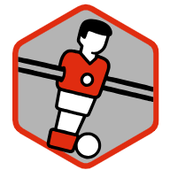

## About Foosball3

### The History of the Foosball App

Back in 2013 our office got its first foosball table, where are colleagues were
convinced they were the best player in the building. We realised that we needed
to organise a tournament in order to objectively establish who was actually best.

For the first tournament matches were scheduled by hand on paper, and nobody
had even thought of a way to rank the player results. The tournament had a winner,
but the results were immediately disputed. Leading to the development of the
first generation foosball app. Essentially a spreadsheet with some Visual Basic
for generating matches.

Yearly editions of the tournament would follow, but results were always
called into question. And participant were distrustful of the black box code
in Visual Basic. A second generation app was developed in R, where code
was shared with colleagues. But still it was not enough.

This lead up to the third generation app, backed by a relational database,
where a graphical user interface was added. It allows to facilitate
tournaments and tracking results live. The package that you see here is the
result of this where the app is bundled in a formal package. All fully open
source, all code can be found at
[github](https://pepijn-devries.github.io/foosball3/).

After more than a decade, we use the app to organise tournaments at multiple
locations, multiple tables were worn, multiple champions were celebrated.
But who's the best player? There's still no agreement on that.
